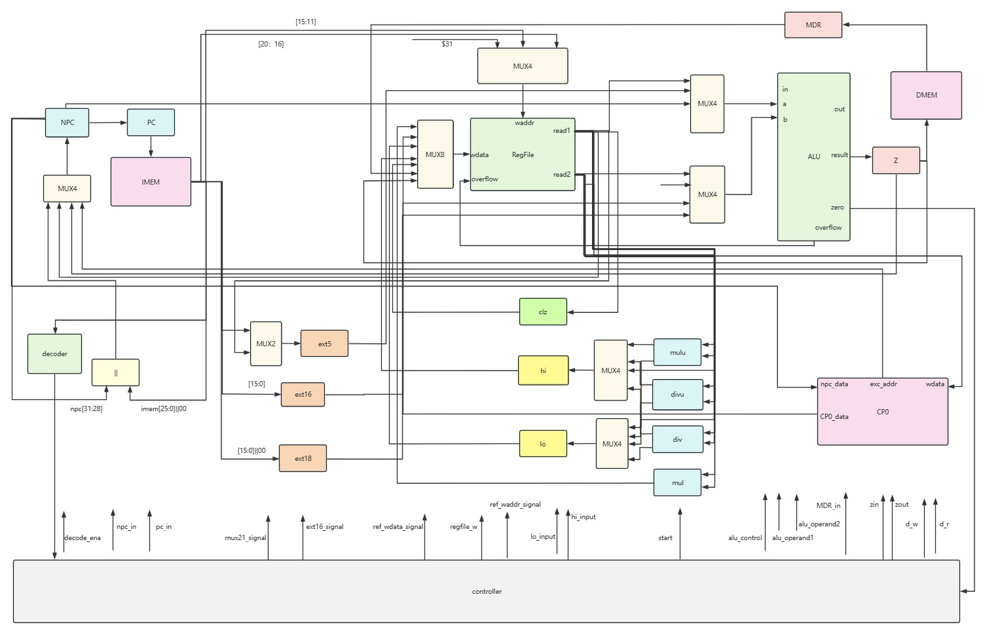

# A multi-cycle CPU which supports 54 Mips instructions

## brief Intro

## about 54 instructions

## holistic design



## Platforms and devices

+ ```Visual Studio Code``` with ```iverilog``` and ```gtkwave```
+ ```vivado 2016.2```
+ DIGILENT Nexys4 DDR™ FPGA Board

## milestones

+ 2023-7-10 14:10 : **Functional simulation** passed.
+ 2023-7-10 22:30 : **post-synthesis simulation** passes.
+ 2023-7-10 22:34 : generate bit stream to **FPGA board** successfully.
